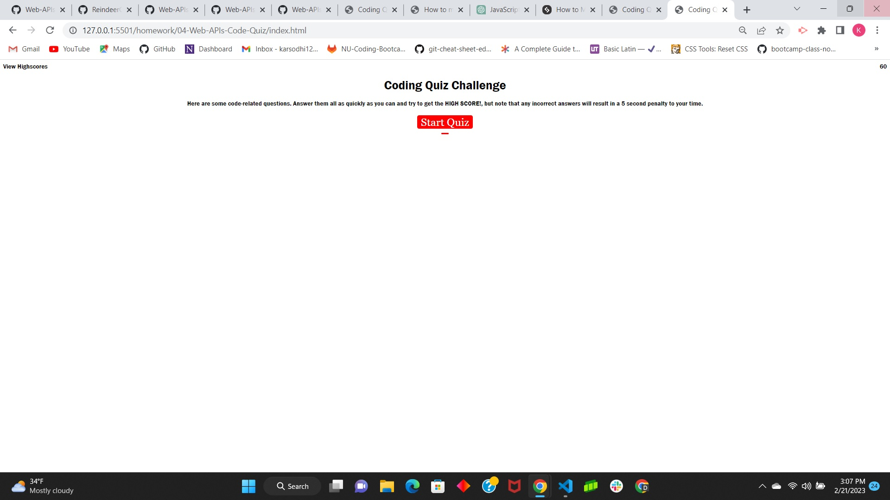
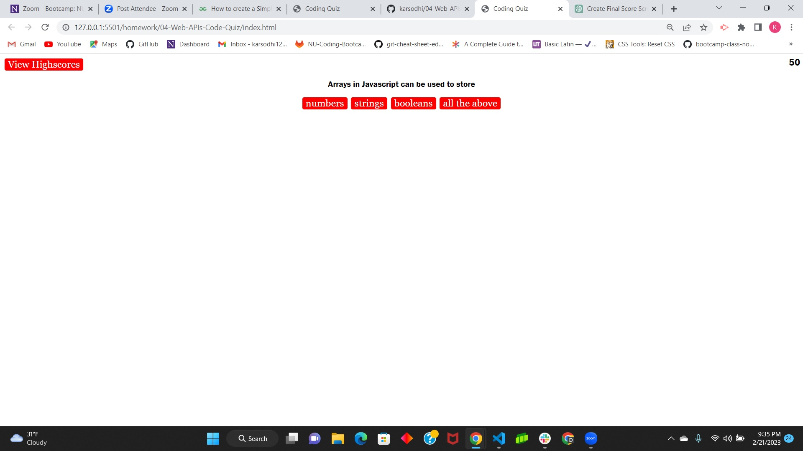

# 04-Web-APIs-Code-Quiz 
Coding Quiz

# 04-homework
This is the fourth homework challenge that was presented to us.  We were to create a multiple choice quiz using HTML, CSS, and javascript.  When an answer is chosen points are added and they are presented a new question.  When an incorrect answer is chosen 5 second runs off the time that they are given.  In the end high scores are documented and placed on an high scores page.  The quiz is 5 questions long.

# Mentions
I worked with a tutor for this assignment through the tutoring session for help and guidance as well as the TA's help from class.

# Links
https://github.com/karsodhi/04-Web-APIs-Code-Quiz

# Screenshots

